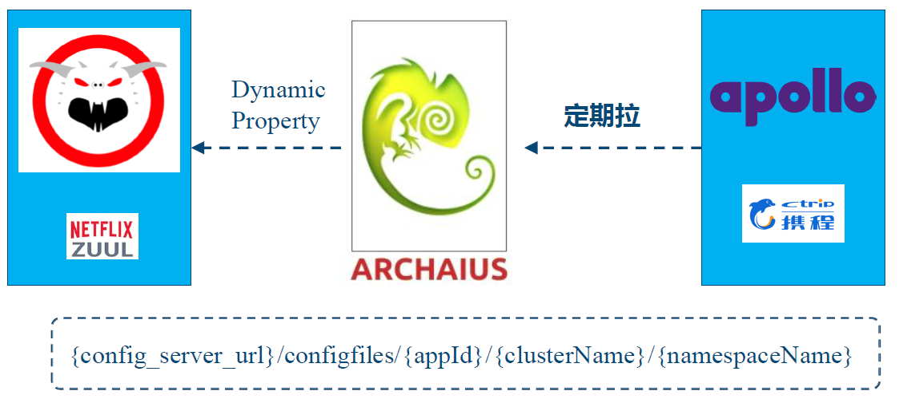
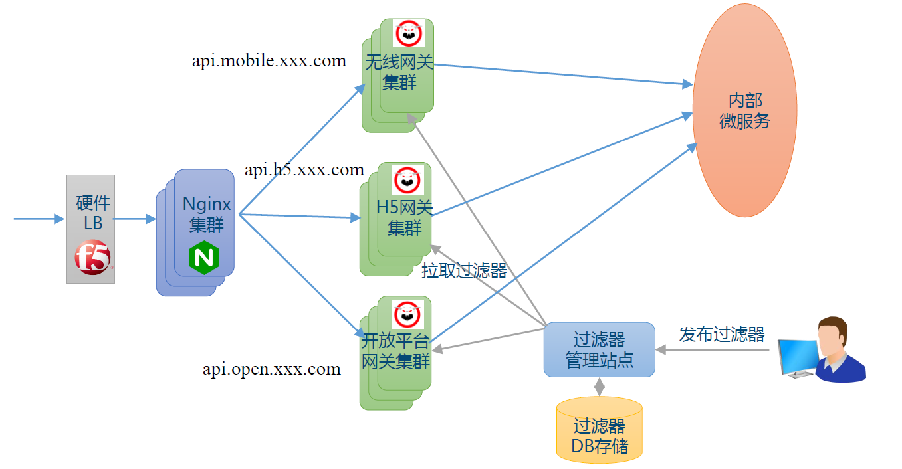
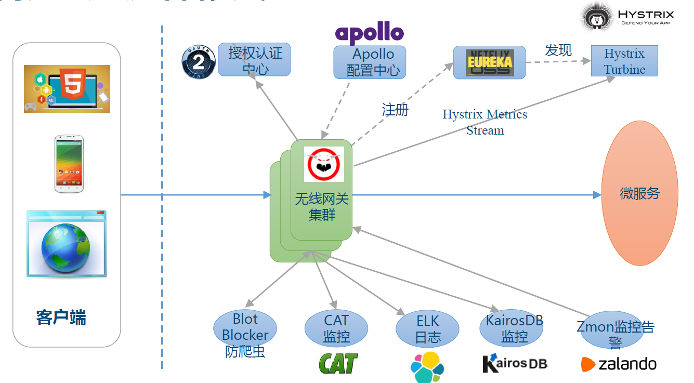
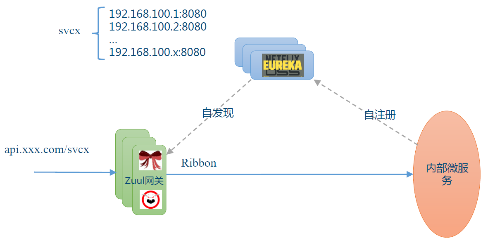
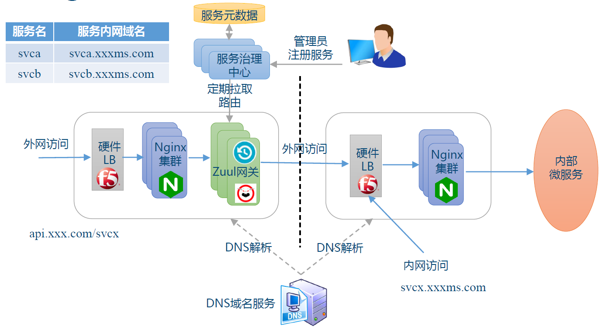
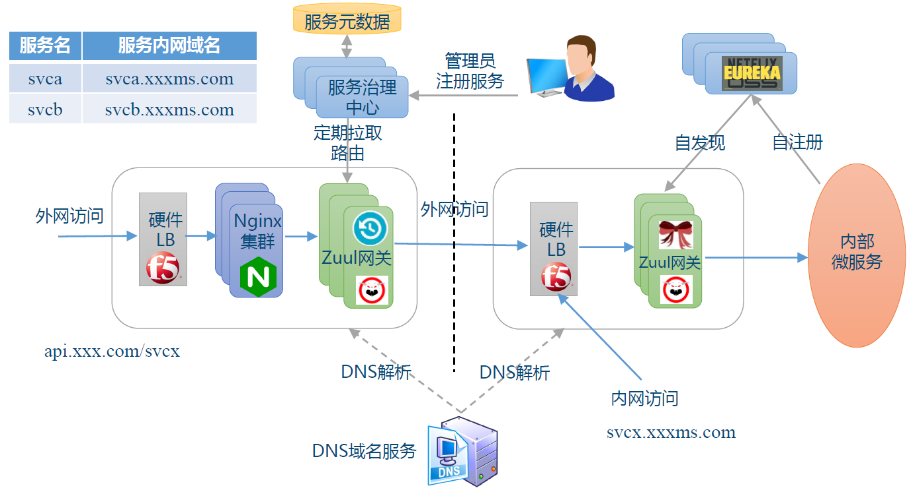

## 实验源码

[zuul源码精简版](https://github.com/spring2go/s2g-zuul)

# Zuul + Archaius + Apollo对接

Netflix Archaius支持组合配置

Netflix Zuul + Archaius + Apollo组合

## 实验步骤

1. 启动01-student-service服务
2. 启动Apollo配置中心本地版本 `./demo.sh start`
3. 启动Zuul+Tomcat服务器
    
    调整InitializeServletListener初始化方法，添加Deploy_config_url为Apollo相关发布地址
    
4. 通过Apollo调整配置项

## 网关部署架构

## 基于Eureka自发现

## 内网Nginx配置
内网nginx静态配置

内网Zuul动态配置

## Netflix Zuul 和 Spring Cloud Zuul
Netflix Zuul支持动态配置

建议在生产级部署使用Netflix Zuul网关

## Netflix Zuul最佳实践
* 异步AsyncServlet优化连接数
* Apollo配置中心集成动态配置
* Hystrix熔断限流
    * 信号量隔离
* 连接池管理
* Cat和Hystrix监控
* 过滤器调试技巧
* 网关无业务逻辑
* 自助路由（需定制扩展）