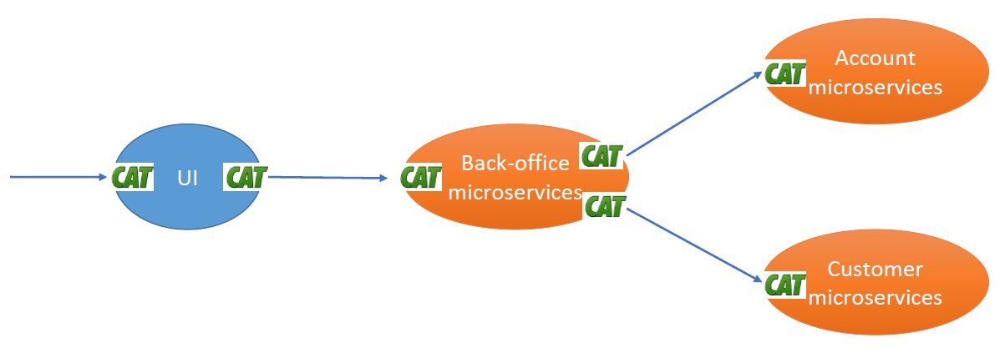
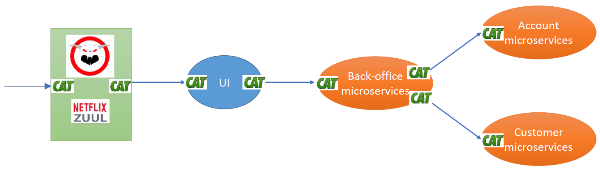
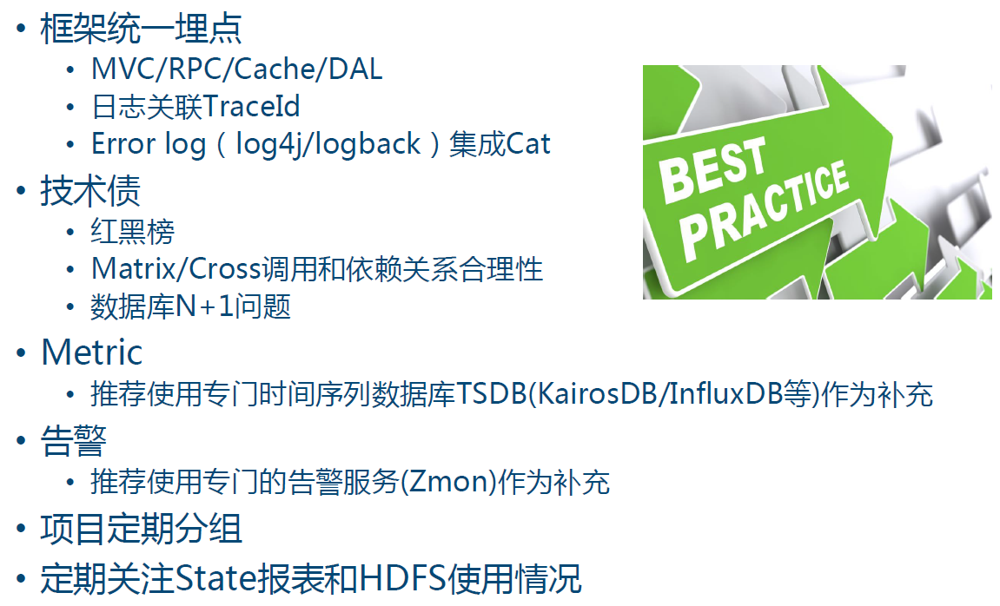
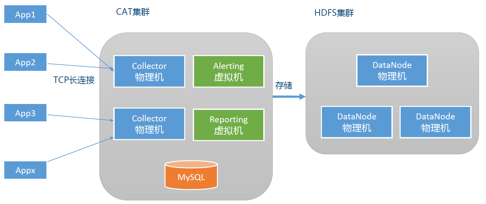

## 服务端部署
[服务端部署](https://github.com/dianping/cat/wiki/readme_server)

## 客户端部署
[客户端部署](https://github.com/dianping/cat/blob/master/lib/java/README.zh-CN.md)

## 客户端埋点实践

## 项目启动
1. 启动cat服务端
2. 分别启动acme-*的四个项目
3. 通过postman分别调用如下API  
    http://localhost:8081/start  
    http://localhost:8081/readtimeout  
4. 接着通过Cat查看Transaction和Problem相关日志

## Zuul网关和Cat集成

1. 需要修改AsyncZuulServlet.service()添加埋点；
2. 在ExecuteRouteFilter路由中添加埋点；
3. 正对外部HttpClient调用添加埋点，ZuulRequestCommandForSemaphoreIsolation.run()。

## Cat生产埋点最佳实践
1. 跨进程时需要将上下文信息传递下去；
2. 异步调用也是跨进程调用，也需要保存上下文信息。

[点评Cat框架埋点集成](https://github.com/dianping/cat/tree/master/integration)，
可以查看logback以及SpringMVC-AOP目录

## 参考部署架构
Cat最小集群部署

