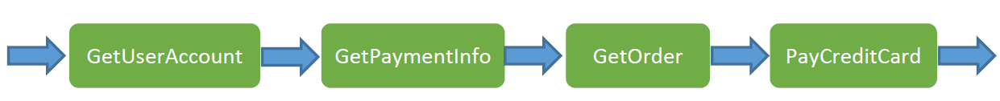

## Hystrix案例-模拟交易


源码[hystrix-examples](https://github.com/Netflix/Hystrix/tree/master/hystrix-examples)

## 服务启动

1. 启动微服务[02-student-service](./02-student-service)和[02-school-service](./02-school-service)项目
2. 通过postman调用school微服务
http://localhost:8088/getSchoolDetails/abcschool


修改[StudentServiceDelegate](./02-school-service/src/main/java/cn/xiaoyu/hystrix/service/delegate/StudentServiceDelegate.java).callStudentService方法上的标注，依次实验各种Hystrix Command标注用法

### HystrixCommand用法
#### 简单用法
```java
 @HystrixCommand
```

#### 定制超时
```java
@HystrixCommand(commandProperties = {
        @HystrixProperty(name = "execution.isolation.thread.timeoutInMilliseconds", value = "4000") })
```

#### 定制降级方法
```java
@HystrixCommand(fallbackMethod = "callStudentService_Fallback")
```

#### 定制线程池隔离策略
```java
@HystrixCommand(fallbackMethod = "callStudentService_Fallback",
    threadPoolKey = "studentServiceThreadPool",
    threadPoolProperties = {
        @HystrixProperty(name="coreSize", value="30"),
        @HystrixProperty(name="maxQueueSize", value="10")
    })
```

#### 查看hystrix stream和dashboard

**hystrix stream:**
http://localhost:8088/hystrix.stream

**hystrix dashboard:**
http://localhost:8088/hystrix